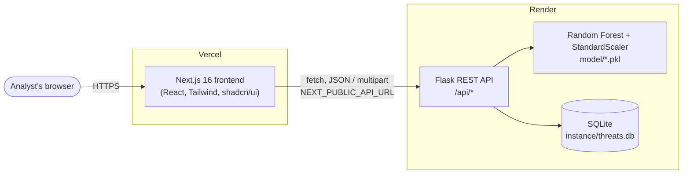

# DefendX — Network Threat Detection with Machine Learning

A full-stack security dashboard that classifies network traffic as **Normal**, **Suspicious** or **Malicious** using a Random Forest model trained on the **CIC-IDS2017** dataset. Analysts can run detections on single samples or upload whole CSV flow files, then triage the resulting alerts and investigate the event logs.

| | |
|---|---|
| **Live app (frontend)** | https://threat-detection-with-ml.vercel.app |
| **Live API (backend)** | https://threat-backend-0wk6.onrender.com |
| **Source** | https://github.com/anand-soni04/Threat-Detection-With-ML |

> **Heads-up:** the backend runs on Render's free tier, which puts the service to sleep after 15 minutes without traffic. The first request after a quiet period can take up to a minute while it wakes up. The Logs and Alerts pages retry automatically.

---

## Table of contents

1. [Features](#features)
2. [Architecture](#architecture)
3. [Tech stack](#tech-stack)
4. [Repository structure](#repository-structure)
5. [Machine-learning pipeline](#machine-learning-pipeline)
6. [Search syntax](#search-syntax)
7. [API reference](#api-reference)
8. [Getting started (run your own copy)](#getting-started-run-your-own-copy)
9. [Deployment](#deployment)
10. [Configuration reference](#configuration-reference)
11. [Known limitations](#known-limitations)
12. [Troubleshooting](#troubleshooting)
13. [Roadmap](#roadmap)

---

## Features

| Page | What it does | Data |
|---|---|---|
| **Dashboard** | Headline KPIs: total events, active alerts, monitored sources | KPI cards are live; charts and map are illustrative |
| **Detection** | Run the model on a sample, or upload a CSV of network flows (up to 100 MB) for batch analysis | Live |
| **Alerts** | Review, search and filter alerts; move them through *Open → Investigating → Resolved*, or *Dismiss* them. Each alert shows its **source** (where the anomaly came from), **target**, and which component **detected** it | Live |
| **Logs** | Auto-refreshing event stream with level/source filters, full-history search, expandable details and CSV export | Live |
| **Search** | Query logs with field filters (`level:ERROR`), time ranges, highlighted matches, saved and recent searches | Live |
| **Analytics** | Traffic trends and attack-vector charts | Static demo view |
| **Data Sources**, **Settings** | Source inventory and preference screens | Static / stored in the browser |

## Architecture



**How a detection flows through the system**

1. The analyst submits a sample or uploads a CSV on the **Detection** page.
2. The frontend sends it to `POST /api/detect` or `POST /api/detect/upload`.
3. The backend maps the input onto the 78 CIC-IDS2017 flow features, scales it with the saved `StandardScaler`, and runs the Random Forest.
4. A **log** row is always written. If the result is *Malicious* or *Suspicious*, an **alert** is created too, linked to that log.
5. The Alerts, Logs, Search and Dashboard pages read the same tables through the API; Logs and Alerts refresh every 5 seconds.

**Design notes**

- The frontend and backend are deployed independently and only talk over HTTPS. The browser calls the API directly, so the backend must allow the frontend's origin ([CORS](#configuration-reference)).
- *Source* and *detected by* are separate concepts. An alert's `source` is the origin of the anomaly (a host/IP you supply, `upload:<filename>` for CSV uploads, or `manual-input`). The component that raised it is returned as `detected_by` (`ml-detector`).
- Timestamps are stored in UTC and returned in IST (`Asia/Kolkata`).

## Tech stack

| Layer | Technology |
|---|---|
| Frontend | Next.js 16 (App Router), React 19, TypeScript, Tailwind CSS 4, shadcn/ui (Radix), Recharts |
| Backend | Python, Flask 3, Flask-SQLAlchemy, Flask-CORS |
| ML | scikit-learn 1.8 (Random Forest), pandas, NumPy, joblib |
| Database | SQLite (single file, committed with demo data) |
| Hosting | Vercel (frontend), Render (backend) |

## Repository structure

```
.
├── Threat_Backend/                 # Flask API + ML model
│   ├── app.py                      # App setup, CORS, blueprint registration
│   ├── config.py                   # Database configuration
│   ├── requirements.txt
│   ├── render.yaml                 # Render service definition (reference)
│   ├── model/
│   │   ├── threat_model.pkl        # Trained Random Forest
│   │   └── scaler.pkl              # Fitted StandardScaler
│   ├── instance/threats.db         # SQLite database (demo data)
│   └── database/
│       ├── models.py               # Log, Alert, TrainingData, ModelMetadata, ApsiDataset
│       └── utils/
│           ├── preprocess.py       # 78-feature mapping + scaling
│           ├── serializers.py      # Shared JSON shapes + search-query parser
│           └── routes/             # detect, logs, alerts, dashboard, analytics, train, apsi
└── Threat_Frontend/                # Next.js dashboard
    ├── .env.production             # NEXT_PUBLIC_API_URL for production builds
    └── src/
        ├── app/                    # Pages: dashboard, detection, alerts, logs, search, analytics, sources, settings
        ├── components/             # Layout, dashboard widgets, shadcn/ui components
        └── lib/                    # api.ts (typed API client), search.ts, utils.ts
```

## Machine-learning pipeline

- **Dataset:** CIC-IDS2017 "MachineLearningCVE" CSVs (network flow records labelled `BENIGN` or by attack type).
- **Task:** binary classification. `BENIGN` → 0, every attack label → 1.
- **Features:** the 78 numeric flow features listed in `database/utils/preprocess.py` (packet counts and lengths, inter-arrival times, TCP flag counts, window sizes, active/idle times, …).
- **Preprocessing:** infinities and NaNs removed, features standardised with `StandardScaler` (saved as `model/scaler.pkl`).
- **Model:** `RandomForestClassifier` (100 trees, max depth 20, balanced class weights) trained on an 80/20 stratified split. Accuracy, precision, recall and F1 are stored in the database when training runs and exposed by the API (`/api/model-stats`, `/api/detect/metrics`).
- **Verdicts:**
  - *Single sample:* the predicted class and its confidence.
  - *CSV upload:* every row is classified and the file receives an overall verdict from the share of malicious rows (*Malicious*, *Suspicious* for a small share, otherwise *Normal*), with alert severity derived from that share.
- **Quick-test samples:** the "Run detection" button sends only three simple values (`packet_size`, `frequency`, `cpu_usage`), which are mapped onto three of the 78 features while the rest default to zero. It is a demo shortcut, not a realistic flow. Upload a real CIC-IDS2017 CSV for meaningful results.

**Retraining** needs the dataset CSVs, which are not committed because of their size (`*.csv` is git-ignored). Place them in a directory and call `POST /api/train-from-dataset` with `{"dataset_path": "<directory>"}`; this overwrites `model/threat_model.pkl` and `model/scaler.pkl`. Commit the new `.pkl` files and redeploy the backend to ship the new model.

> The model in `model/` must be trained with the scikit-learn version pinned in `requirements.txt`; pickles are not guaranteed to load across versions.

## Search syntax

Used by the **Logs** search box, the **Search** page and the header search. Terms are combined with AND (the word `AND` is optional) and matching is case-insensitive.

| Query | Meaning |
|---|---|
| `malicious` | Free text across message, source, service, level and prediction (and uploaded file names) |
| `level:ERROR` | Field filter. Fields: `level`, `source`, `service`, `prediction`, `message`, `id` |
| `service:ml-model-upload AND malicious` | Combine terms |
| `"rows malicious"` | Exact phrase |
| `source:"upload:my file.csv"` | Quote values that contain spaces |

Levels are `ERROR` (malicious), `WARN` (suspicious) and `INFO` (normal). The Search page also offers a time range (15 minutes, 1 hour, 24 hours, 7 days, 30 days, all time).

## API reference

All routes are prefixed with `/api`. Examples use the live API; substitute your own backend URL if you deploy a copy.

| Method | Route | Description |
|---|---|---|
| `GET` | `/dashboard/stats` | KPI counts for the dashboard |
| `POST` | `/detect` | Classify one sample (JSON body) |
| `POST` | `/detect/upload` | Classify a CSV file (`multipart/form-data`, field `file`, max 100 MB) |
| `GET` | `/detect/metrics`, `/model-stats` | Model performance metadata |
| `GET` | `/logs` | List logs. Query params: `q`, `level`, `source`, `range`, `limit` (default 500, max 5000) |
| `GET` | `/logs/search` | Search logs. Params: `q`, `range` (`15m`, `1h`, `24h`, `7d`, `30d`), `limit`, `count=1` (return only `{"count": n}`) |
| `GET` | `/alerts` | List alerts, newest first |
| `GET` / `PATCH` / `DELETE` | `/alerts/<id>` | Read one alert; update `status` (`open`, `investigating`, `resolved`, `dismissed`); delete |
| `GET` | `/analytics/*` | `threat-trend`, `hourly`, `top-sources`, `attack-vectors` |
| `POST` | `/train-from-dataset` | Retrain the model from a dataset directory |
| `GET` | `/dataset-stats`, `/sample-dataset` | Dataset inspection helpers |

```bash
# Classify a sample, optionally telling the system where it came from
curl -X POST https://threat-backend-0wk6.onrender.com/api/detect \
  -H "Content-Type: application/json" \
  -d '{"packet_size": 1500, "frequency": 80, "cpu_usage": 0.9, "source": "10.0.0.7", "target": "web-01"}'
# -> {"prediction": "Normal" | "Malicious", "confidence": 93.02, "log_id": 46}

# Search for malicious detections
curl "https://threat-backend-0wk6.onrender.com/api/logs/search?q=prediction:malicious&limit=10"

# Dismiss an alert
curl -X PATCH https://threat-backend-0wk6.onrender.com/api/alerts/12 \
  -H "Content-Type: application/json" -d '{"status": "dismissed"}'
```

An alert looks like this:

```json
{
  "id": "27",
  "type": "threat_detection",
  "severity": "critical",
  "source": "upload:webattacks_medium_test_10k.csv",
  "target": "system",
  "detected_by": "ml-detector",
  "message": "Malicious activity detected in uploaded file ...",
  "timestamp": "2026-03-20T13:29:09+05:30",
  "status": "open",
  "log_id": 45
}
```

## Getting started (run your own copy)

**Prerequisites:** Python 3.11+ (3.12 recommended), Node.js 20+, npm, Git.

### 1. Clone

```bash
git clone https://github.com/anand-soni04/Threat-Detection-With-ML.git
cd Threat-Detection-With-ML
```

### 2. Backend

```bash
cd Threat_Backend
python -m venv venv
source venv/bin/activate          # Windows: venv\Scripts\activate
pip install -r requirements.txt
python app.py
```

The server listens on the port in the `PORT` environment variable (default `5000`). The SQLite database and the trained model are already in the repo, so there is nothing else to set up. Allow your frontend to call it by setting its address before starting the server:

```bash
export ALLOWED_ORIGINS="<the address your frontend dev server prints>"
```

### 3. Frontend

```bash
cd Threat_Frontend
npm install
echo "NEXT_PUBLIC_API_URL=<your backend's base URL>" > .env.local
npm run dev
```

`npm run dev` prints the address to open in your browser. If you skip `NEXT_PUBLIC_API_URL`, the frontend uses the hosted API.

### 4. Try it

1. Open **Detection** and run a detection. A new row appears under **Logs** (and under **Alerts** if it was flagged).
2. Upload a CIC-IDS2017 CSV on **Detection** to analyse a whole file.
3. Open **Search** and try `level:ERROR` or `prediction:malicious`.

## Deployment

The project is split into two services. **Deploy the backend first**, then the frontend, because the frontend depends on the backend's API.

### Backend → Render

1. In the Render dashboard choose **New → Web Service** and connect the GitHub repository.
2. Settings:

   | Field | Value |
   |---|---|
   | Root Directory | `Threat_Backend` |
   | Runtime | Python 3 |
   | Build Command | `pip install -r requirements.txt` |
   | Start Command | `python app.py` |
   | Instance type | Free |

3. Under **Environment**, add:
   - `PYTHON_VERSION` — a fully qualified version such as `3.12.8` (the Render build log shows the version in use).
   - `ALLOWED_ORIGINS` — your frontend's URL, e.g. `https://threat-detection-with-ml.vercel.app` (comma-separate several).
4. Deploy. Render injects `PORT` automatically and `app.py` already reads it.
5. Verify: open `<your-backend-url>/api/dashboard/stats`; it should return JSON.

### Frontend → Vercel

1. In Vercel choose **Add New → Project** and import the same repository.
2. Settings:

   | Field | Value |
   |---|---|
   | Framework Preset | Next.js |
   | Root Directory | `Threat_Frontend` |

3. Add the environment variable `NEXT_PUBLIC_API_URL` = your Render backend URL (no trailing slash). Production builds also read it from `Threat_Frontend/.env.production`.
4. Deploy.

> `NEXT_PUBLIC_*` variables are baked in at **build time**. After changing one you must redeploy the frontend for it to take effect.

### Re-deploying after a change

Both platforms deploy automatically on every push to the connected branch:

```bash
git add -A
git commit -m "Describe your change"
git push origin main
```

Redeploy the backend first when an API change is involved, then the frontend. You can also trigger a manual redeploy from each dashboard (Render: **Manual Deploy**; Vercel: **Deployments → ⋯ → Redeploy**).

## Configuration reference

| Variable | Where | Purpose | Default |
|---|---|---|---|
| `NEXT_PUBLIC_API_URL` | Frontend (build time) | Base URL of the backend API | `https://threat-backend-0wk6.onrender.com` |
| `ALLOWED_ORIGINS` | Backend | Comma-separated origins allowed by CORS | `https://threat-detection-with-ml.vercel.app` |
| `PORT` | Backend | Port to listen on (Render sets it) | `5000` |
| `PYTHON_VERSION` | Render | Python version for builds | Render's default |

Vercel *preview* deployments get their own URLs, which are not in the default allow-list. Add them to `ALLOWED_ORIGINS` if you want previews to reach the API.

## Known limitations

- **Free-tier cold starts.** The first request after 15 idle minutes is slow while Render wakes the service.
- **Data does not persist across redeploys.** The database is a SQLite file in the repository, and Render's free-tier disk is ephemeral. Alerts you dismiss or logs you create are lost when the service restarts or redeploys and reset to the committed demo data. For durable storage, move to a managed database such as Render Postgres (change `SQLALCHEMY_DATABASE_URI` in `config.py`).
- **Large uploads.** Uploads are capped at 100 MB and processed row by row on a 512 MB free instance, so very large files may be slow or run out of memory.
- **Demo-quality inputs.** The quick-test detection uses only three of the 78 features. Use real flow CSVs for realistic results.
- **No authentication.** The API is open. Do not use it with sensitive data.
- **Static pages.** Analytics, Data Sources, Settings, the dashboard charts/map and the header notifications are illustrative and not yet backed by the API.

## Troubleshooting

| Symptom | Likely cause and fix |
|---|---|
| Pages show "Could not load ... from the server" | The backend is waking up (wait about a minute) or is down. Check `<backend-url>/api/dashboard/stats`. |
| Browser console shows a CORS error | The frontend's origin is not in the backend's `ALLOWED_ORIGINS`. Add it and redeploy the backend. |
| Frontend still calls the old API after changing `NEXT_PUBLIC_API_URL` | The variable is read at build time. Redeploy the frontend. |
| Render build fails installing `numpy` / `scikit-learn` | Python version too old. Set `PYTHON_VERSION` to 3.11 or newer. |
| `InconsistentVersionWarning` / model fails to load | The `.pkl` files were created with a different scikit-learn version. Retrain with the pinned version. |
| Dismissed alerts or new logs disappear | Expected on Render's free tier; see [Known limitations](#known-limitations). |

## Roadmap

- Move persistence to a managed database
- Back the Analytics, Data Sources and notification widgets with real data
- Authentication and role-based access
- Live updates over WebSockets instead of polling
- Multi-class attack classification (DoS, PortScan, Brute Force, …) instead of binary
- Containerisation (Docker) and CI checks
